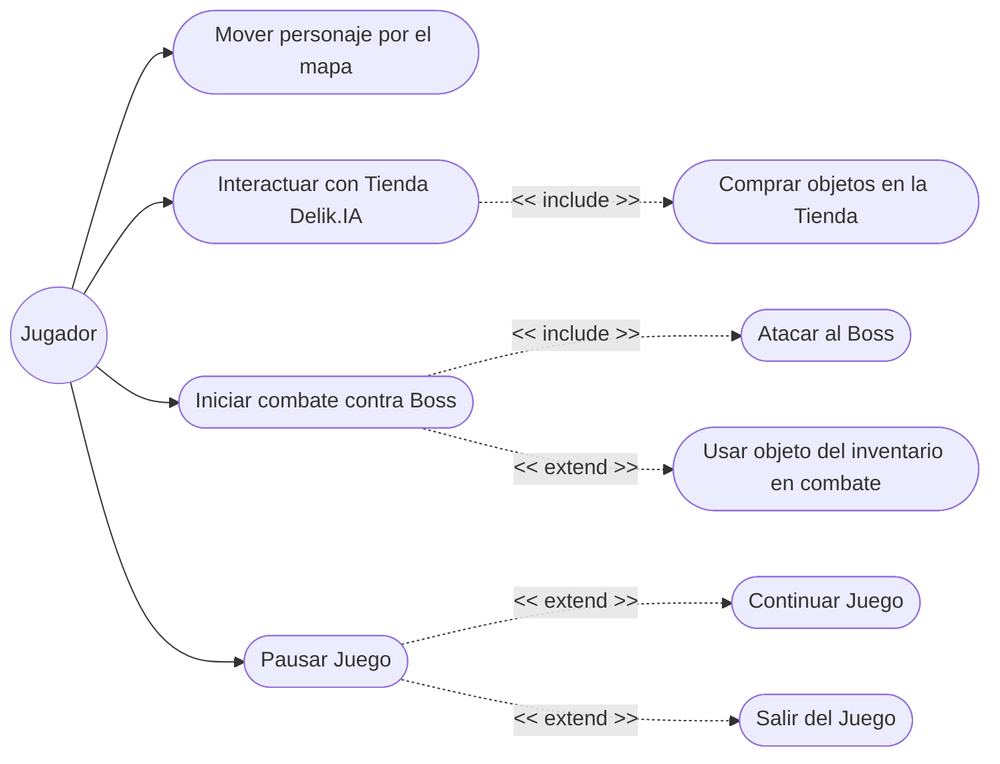

## Diagrama de Casos de Uso

## Descripción de los Casos de Uso

1. **Mover personaje por el mapa**: El jugador puede utilizar las teclas (W, A, S, D) para moverse por el `PanelMapa`. Sus acciones son recibidas por el `ControladorMovimiento` que comprueba las colisiones (`Colisiones`) antes de actualizar la posición del `Personaje`.
2. **Interactuar con Tienda Delik.IA**: Si el jugador se sitúa en el área de la tienda referenciada, puede pulsar la tecla 'E' para abrir el `PanelTienda`.
3. **Comprar objetos en la Tienda (*include*)**: Dentro del `PanelTienda`, el jugador visualiza una cuadrícula de ítems (vaper, mantequilla, gabardina, etc.) que puede adquirir.
4. **Iniciar combate contra Boss**: Si el jugador está dentro de la zona de interacción de algún Boss (*Soraya, Sergio, Jessica, Juan Carlos*), pulsando 'E' inicia la pelea entrando en la ventana de `PanelCombate`.
5. **Atacar al Boss (*include*)**: Dentro del `PanelCombate`, la acción principal es presionar el botón de atacar mediante la lógica definida en `Personaje` (verificando si es un impacto crítico y reduciendo la vida del enemigo).
6. **Usar objeto del inventario (*extend*)**: Opcionalmente, durante el combate el jugador puede revisar su inventario (botón "Usar Objeto") y usar un `Item` para curarse o atacar al Boss.
7. **Pausar Juego**: Pulsando la tecla *ESCAPE* durante la navegación por el mapa (`PanelMapa`), el jugador pausa el juego y despliega un menú.
8. **Continuar / Salir (*extend*)**: Desde el menú de pausa (`JDialog` creado en la clase PanelMapa) se puede continuar el movimiento o cerrar toda la ventana y terminar el proceso de juego.

Este listado y diagrama representa con precisión la arquitectura en *Modelo-Vista-Controlador* acoplada al comportamiento e interacción desde la perspectiva del propio Jugador.
