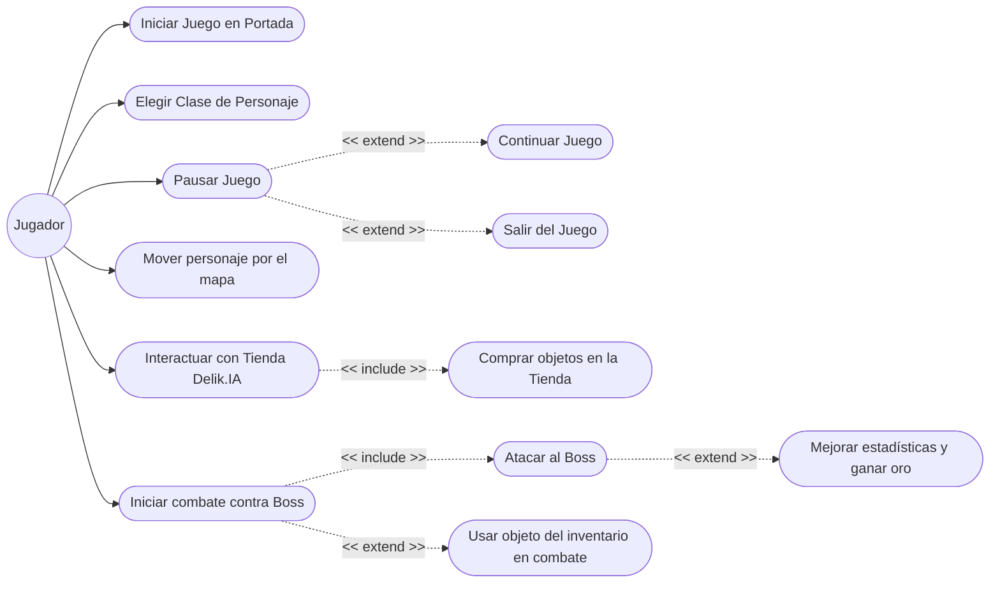

# Documento de Casos de Uso - Videojuego

## Diagrama de Casos de Uso

## Descripción de los Casos de Uso

1. **Iniciar Juego en Portada**: El jugador arranca la aplicación e inicia desde el `PanelPortada`, teniendo la opción de comenzar o salir.
2. **Elegir Clase de Personaje**: En el `PanelEleccionPersonaje`, el jugador selecciona entre distintas clases (Guerrero, Asesino, Mago) y previsualiza sus estadísticas iniciales.
3. **Mover personaje por el mapa**: El jugador puede utilizar las teclas (W, A, S, D) para moverse por el `PanelMapa`. Sus acciones son recibidas por el `ControladorMovimiento` que comprueba las variables de `Colisiones` antes de actualizar la posición del `Personaje`.
4. **Interactuar con Tienda Delik.IA**: Si el jugador se sitúa en el área de la tienda referenciada, puede pulsar la tecla 'E' para abrir el `PanelTienda`.
5. **Comprar objetos en la Tienda (*include*)**: Dentro del `PanelTienda`, el jugador visualiza una cuadrícula de ítems gestionados por la clase `Tienda` (vaper, mantequilla, gabardina, etc.) que puede adquirir gastando sus monedas, verificando las restricciones de dinero e inventario máximo.
6. **Iniciar combate contra Boss**: Si el jugador está dentro de la zona de interacción de algún Boss (*Soraya, Sergio, Jessica, Juan Carlos*), pulsando 'E' inicia la pelea entrando en la ventana de `PanelCombate`.
7. **Atacar al Boss (*include*)**: Dentro del `PanelCombate`, la acción principal es presionar el botón de atacar mediante la lógica definida en `Personaje` (verificando si es un impacto crítico y reduciendo la vida del enemigo). El enemigo automáticamente contraataca si sobrevive.
8. **Usar objeto del inventario en combate (*extend*)**: Opcionalmente, durante el combate el jugador puede revisar su inventario (botón "Usar Objeto") y usar un `Item` para curarse, aplicarse un escudo, o hacer daño directo al Boss según el `TipoEfecto` del ítem.
9. **Mejorar estadísticas y ganar oro (*extend*)**: Si como resultado de atacar el jugador logra que la vida del Boss llegue a 0, automáticamente se aplica un incremento de stats (`mejorarAtributosAlDerrotarBoss`) y se le otorga dinero al jugador antes de permitirle salir del combate.
10. **Pausar Juego**: Pulsando la tecla *ESCAPE* durante la navegación por el mapa (`PanelMapa`), el jugador pausa el juego y despliega la ventana modal `MenuEscape`.
11. **Continuar / Salir (*extend*)**: Desde el menú de pausa (`MenuEscape`), se puede elegir botón para continuar el movimiento (volviendo atrás) o cerrar toda la ventana y finalizar el proceso.
