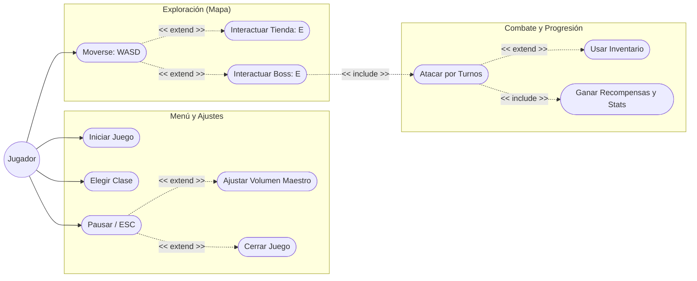

# Documento de Casos de Uso - Videojuego ELDAP

## Diagrama de Casos de Uso

## Descripción Técnica de Casos de Uso

1. **Ajustar Volumen Maestro**: Durante la pausa (`MenuEscape`), el jugador desliza el JSlider. La vista notifica a `ControladorAudio` (Singleton) para aplicar el cambio en decibelios mediante `setVolumenGlobal(int)`.
2. **Interactuar Tienda / Boss**: Requiere proximidad física detectada en `PanelMapa` (variables `cercaDeDelikia` o `bossCercano`). La acción se dispara con la tecla 'E'.
3. **Moverse (WASD)**: El `ControladorMovimiento` procesa múltiples teclas para permitir fluidez, consultando a `Colisiones` antes de mover el sprite en el `PanelMapa`.
4. **Mejorar Estadísticas**: Al derrotar un jefe, se invoca `mejorarAtributosAlDerrotarBoss()` en la clase `Personaje`, incrementando permanentemente Vida Máxima y Ataque. El progreso es visualizado en el `PanelEstadisticasHUD`.
5. **Usar Inventario**: Durante el combate, el jugador elige entre sus 2 slots de objetos. El `PanelCombate` invoca `jugador.usarItem(indice, enemigo)`, aplicando efectos como "Crítico Seguro" o "Robo de Vida".
