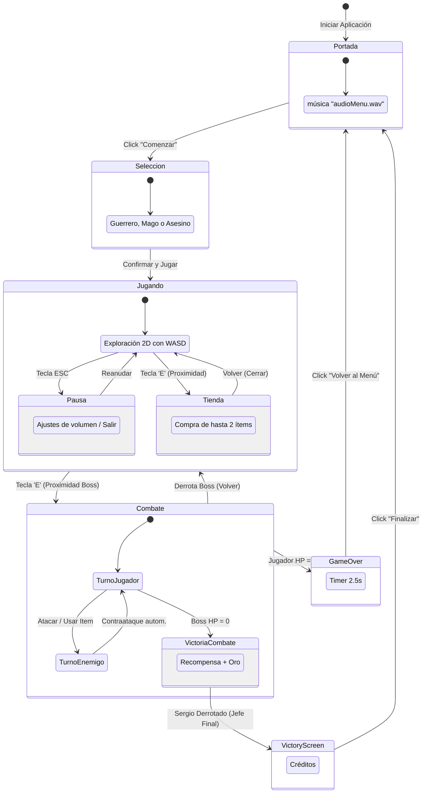

# Diagrama de Estados - Videojuego ELDAP

El siguiente diagrama detalla los estados globales de la aplicación y las transiciones entre ellos, gestionadas por la `VentanaPrincipal` y su `CardLayout`.

## Descripción de Estados

1.  **Portada**: El estado inicial del juego. Carga la música de ambiente del menú.
2.  **Selección**: Estado de configuración donde se instancia el objeto `Personaje` con sus slots de inventario vacíos.
3.  **Mapa (Exploración)**: Estado principal de juego. Permite la libre navegación y la entrada a sub-estados como la **Tienda** o la **Pausa**.
4.  **Combate**: Estado crítico donde la música cambia y se bloquea la exploración. El flujo es cíclico entre los turnos de las entidades hasta que una muere.
5.  **Game Over / Victory**: Estados terminales de una sesión. Al salir de ellos, se limpia la instancia del personaje y el mapa para un reinicio fresco.
