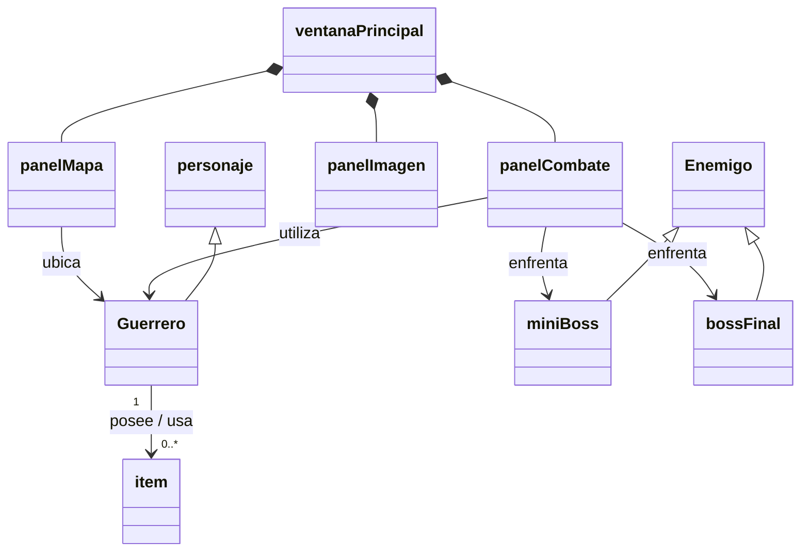

# Videojuego-Java

```mermaid
classDiagram
    %% Clases
    class personaje
    class Guerrero
    class Enemigo
    class miniBoss
    class bossFinal
    class item
    class ventanaPrincipal
    class panelImagen 
    class panelCombate
    class panelMapa

    %% Herencias
    personaje <|-- Guerrero
    Enemigo <|-- miniBoss
    Enemigo <|-- bossFinal

    %% Relaciones de Interfaz Gráfica (Composición)
    ventanaPrincipal *-- panelImagen
    ventanaPrincipal *-- panelCombate
    ventanaPrincipal *-- panelMapa

    %% Relaciones y Asociaciones del Juego
    Guerrero "1" --> "0..*" item : posee / usa
    panelCombate --> Guerrero : utiliza
    panelCombate --> miniBoss : enfrenta
    panelCombate --> bossFinal : enfrenta
    panelMapa --> Guerrero : ubica
```