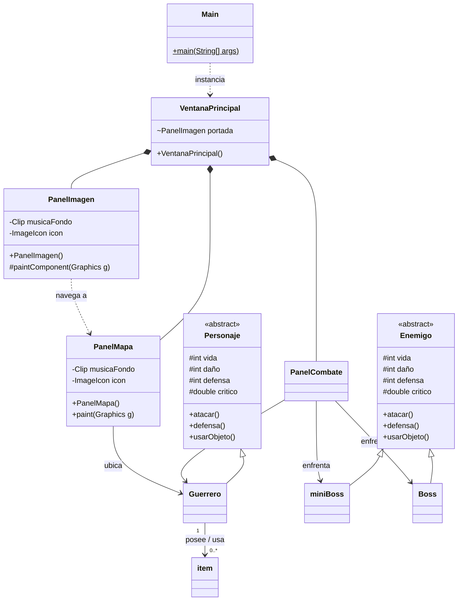

# Videojuego-Java

```mermaid
classDiagram
    %% Clases del Modelo
    class Personaje {
        <<abstract>>
        #int vida
        #int daño
        #int defensa
        #double critico
        +atacar()
        +defensa()
        +usarObjeto()
    }
    class Guerrero {
    }
    class Enemigo {
        <<abstract>>
        #int vida
        #int daño
        #int defensa
        #double critico
        +atacar()
        +defensa()
        +usarObjeto()
    }
    class miniBoss {
    }
    class Boss {
    }
    class item {
    }

    %% Clases de la Vista
    class VentanaPrincipal {
        ~PanelImagen portada
        +VentanaPrincipal()
    }
    class PanelImagen {
        -Clip musicaFondo
        -ImageIcon icon
        +PanelImagen()
        #paintComponent(Graphics g)
    }
    class PanelMapa {
        -Clip musicaFondo
        -ImageIcon icon
        +PanelMapa()
        +paint(Graphics g)
    }
    class PanelCombate {
    }
    
    %% Clase Principal
    class Main {
        +main(String[] args)$
    }

    %% Herencias
    Personaje <|-- Guerrero
    Enemigo <|-- miniBoss
    Enemigo <|-- Boss

    %% Relaciones de Interfaz Gráfica (Composición)
    VentanaPrincipal *-- PanelImagen
    VentanaPrincipal *-- PanelCombate
    VentanaPrincipal *-- PanelMapa

    %% Relaciones y Asociaciones del Juego
    Guerrero "1" --> "0..*" item : posee / usa
    PanelCombate --> Guerrero : utiliza
    PanelCombate --> miniBoss : enfrenta
    PanelCombate --> Boss : enfrenta
    PanelMapa --> Guerrero : ubica
    
    %% Dependencias según el código actual
    Main ..> VentanaPrincipal : instancia
    PanelImagen ..> PanelMapa : navega a
```