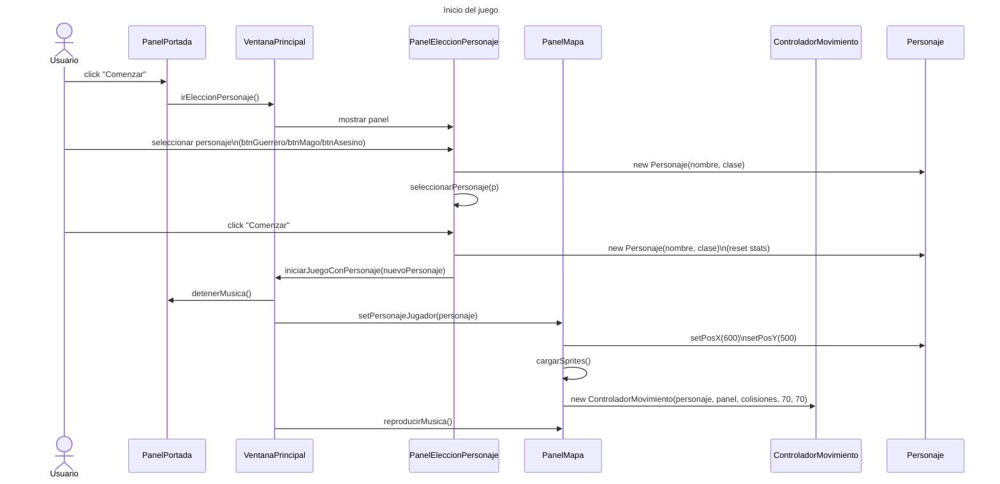
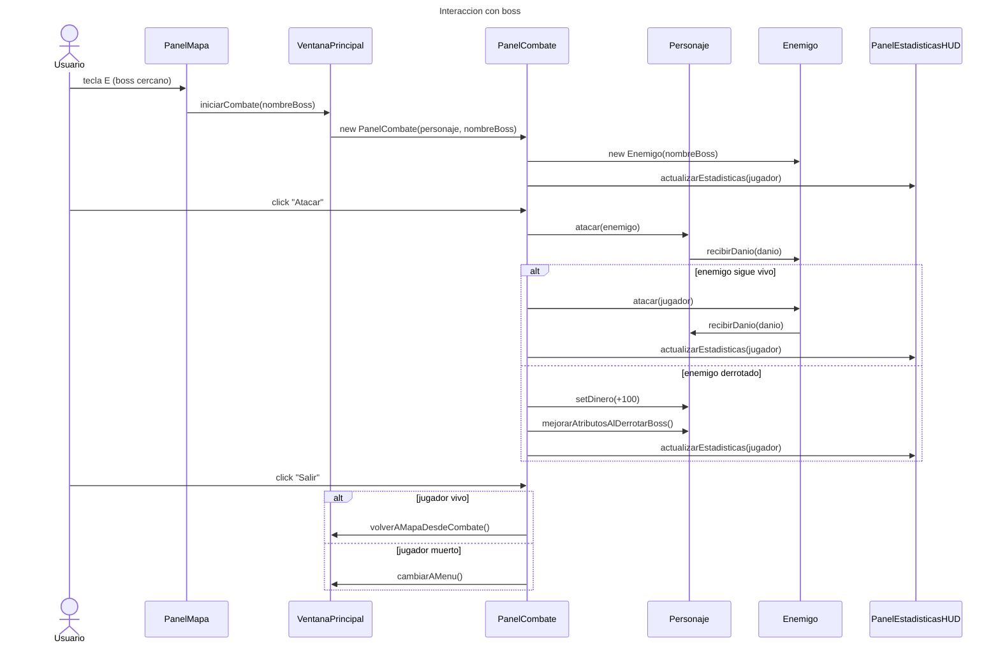
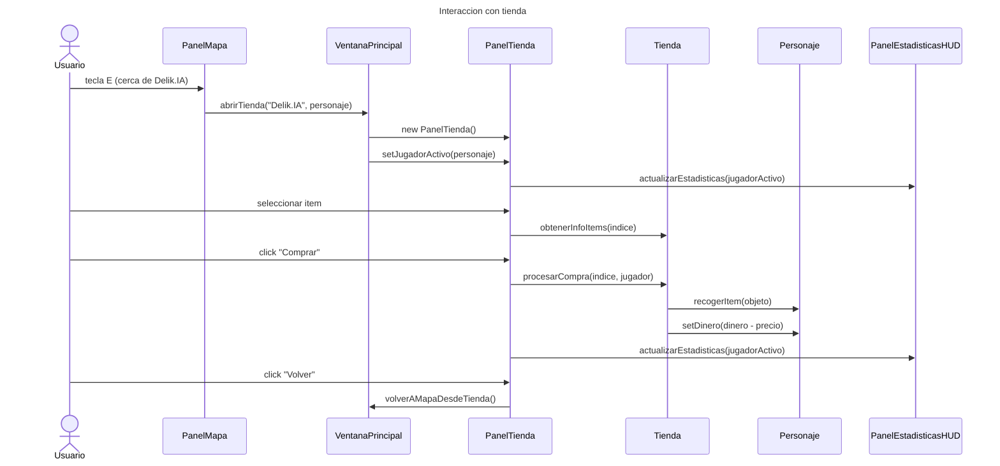

**Parte 1: Menu principal y seleccion**

```mermaid
sequenceDiagram
title Inicio del juego

actor Usuario
participant PanelPortada
participant VentanaPrincipal
participant PanelEleccionPersonaje
participant PanelMapa
participant ControladorMovimiento
participant Personaje

Usuario->>PanelPortada: click "Comenzar"
PanelPortada->>VentanaPrincipal: irEleccionPersonaje()
VentanaPrincipal->>PanelEleccionPersonaje: mostrar panel

Usuario->>PanelEleccionPersonaje: seleccionar personaje\n(btnGuerrero/btnMago/btnAsesino)
PanelEleccionPersonaje->>Personaje: new Personaje(nombre, clase)
PanelEleccionPersonaje->>PanelEleccionPersonaje: seleccionarPersonaje(p)

Usuario->>PanelEleccionPersonaje: click "Comenzar"
PanelEleccionPersonaje->>Personaje: new Personaje(nombre, clase)\n(reset stats)
PanelEleccionPersonaje->>VentanaPrincipal: iniciarJuegoConPersonaje(nuevoPersonaje)

VentanaPrincipal->>PanelPortada: detenerMusica()
VentanaPrincipal->>PanelMapa: setPersonajeJugador(personaje)
PanelMapa->>Personaje: setPosX(600)\nsetPosY(500)
PanelMapa->>PanelMapa: cargarSprites()
PanelMapa->>ControladorMovimiento: new ControladorMovimiento(personaje, panel, colisiones, 70, 70)
VentanaPrincipal->>PanelMapa: reproducirMusica()
```

**Parte 2: Combate (desde el mapa)**

```mermaid
sequenceDiagram
title Interaccion con boss

actor Usuario
participant PanelMapa
participant VentanaPrincipal
participant PanelCombate
participant Personaje
participant Enemigo
participant HUD as PanelEstadisticasHUD

Usuario->>PanelMapa: tecla E (boss cercano)
PanelMapa->>VentanaPrincipal: iniciarCombate(nombreBoss)
VentanaPrincipal->>PanelCombate: new PanelCombate(personaje, nombreBoss)
PanelCombate->>Enemigo: new Enemigo(nombreBoss)
PanelCombate->>HUD: actualizarEstadisticas(jugador)

Usuario->>PanelCombate: click "Atacar"
PanelCombate->>Personaje: atacar(enemigo)
Personaje->>Enemigo: recibirDanio(danio)

alt enemigo sigue vivo
    PanelCombate->>Enemigo: atacar(jugador)
    Enemigo->>Personaje: recibirDanio(danio)
    PanelCombate->>HUD: actualizarEstadisticas(jugador)
else enemigo derrotado
    PanelCombate->>Personaje: setDinero(+100)
    PanelCombate->>Personaje: mejorarAtributosAlDerrotarBoss()
    PanelCombate->>HUD: actualizarEstadisticas(jugador)
end

Usuario->>PanelCombate: click "Salir"
alt jugador vivo
    PanelCombate->>VentanaPrincipal: volverAMapaDesdeCombate()
else jugador muerto
    PanelCombate->>VentanaPrincipal: cambiarAMenu()
end
```

**Parte 3: Tienda (desde el mapa)**

```mermaid
sequenceDiagram
title Interaccion con tienda

actor Usuario
participant PanelMapa
participant VentanaPrincipal
participant PanelTienda
participant Tienda
participant Personaje
participant HUD as PanelEstadisticasHUD

Usuario->>PanelMapa: tecla E (cerca de Delik.IA)
PanelMapa->>VentanaPrincipal: abrirTienda("Delik.IA", personaje)
VentanaPrincipal->>PanelTienda: new PanelTienda()
VentanaPrincipal->>PanelTienda: setJugadorActivo(personaje)
PanelTienda->>HUD: actualizarEstadisticas(jugadorActivo)

Usuario->>PanelTienda: seleccionar item
PanelTienda->>Tienda: obtenerInfoItems(indice)

Usuario->>PanelTienda: click "Comprar"
PanelTienda->>Tienda: procesarCompra(indice, jugador)
Tienda->>Personaje: recogerItem(objeto)
Tienda->>Personaje: setDinero(dinero - precio)
PanelTienda->>HUD: actualizarEstadisticas(jugadorActivo)

Usuario->>PanelTienda: click "Volver"
PanelTienda->>VentanaPrincipal: volverAMapaDesdeTienda()
```
