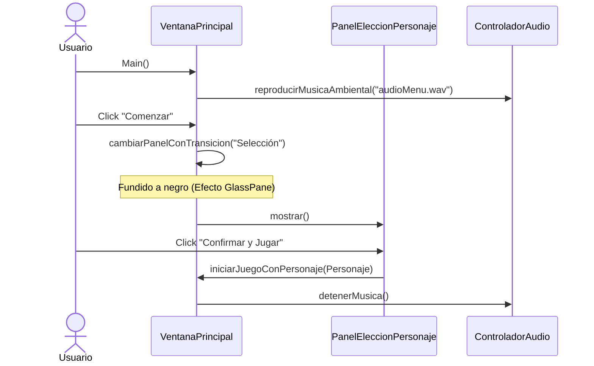
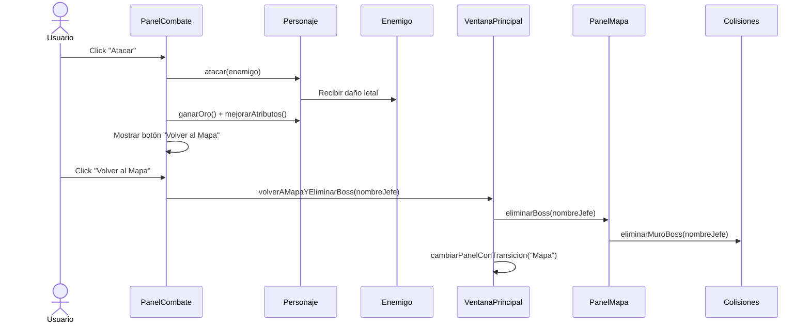
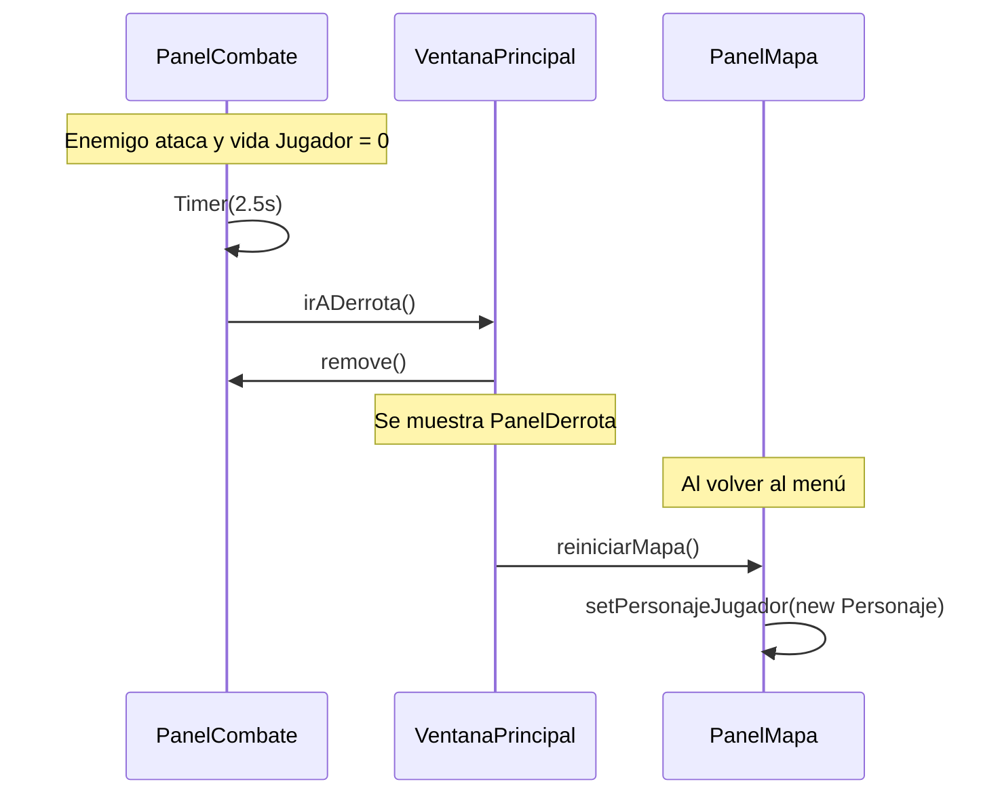

# Diagramas de Secuencia - Ciclos de Ejecución ELDAP

## 1. Inicio con Transición Visual

```mermaid
sequenceDiagram
    actor U as Usuario
    participant VP as VentanaPrincipal
    participant PE as PanelEleccionPersonaje
    participant CA as ControladorAudio

    U->>VP: Main()
    VP->>CA: reproducirMusicaAmbiental("audioMenu.wav")
    U->>VP: Click "Comenzar"
    VP->>VP: cambiarPanelConTransicion("Selección")
    Note over VP: Fundido a negro (Efecto GlassPane)
    VP->>PE: mostrar()
    U->>PE: Click "Confirmar y Jugar"
    PE->>VP: iniciarJuegoConPersonaje(Personaje)
    VP->>CA: detenerMusica()
```

## 2. Victoria sobre Jefe Intermedio

```mermaid
sequenceDiagram
    actor U as Usuario
    participant PC as PanelCombate
    participant P as Personaje
    participant E as Enemigo
    participant VP as VentanaPrincipal
    participant PM as PanelMapa
    participant COL as Colisiones

    U->>PC: Click "Atacar"
    PC->>P: atacar(enemigo)
    P->>E: Recibir daño letal
    PC->>P: ganarOro() + mejorarAtributos()
    PC->>PC: Mostrar botón "Volver al Mapa"
    U->>PC: Click "Volver al Mapa"
    PC->>VP: volverAMapaYEliminarBoss(nombreJefe)
    VP->>PM: eliminarBoss(nombreJefe)
    PM->>COL: eliminarMuroBoss(nombreJefe)
    VP->>VP: cambiarPanelConTransicion("Mapa")
```

## 3. Derrota y Reinicio

```mermaid
sequenceDiagram
    participant PC as PanelCombate
    participant VP as VentanaPrincipal
    participant PM as PanelMapa

    Note over PC: Enemigo ataca y vida Jugador = 0
    PC->>PC: Timer(2.5s)
    PC->>VP: irADerrota()
    VP->>PC: remove()
    Note over VP: Se muestra PanelDerrota
    Note over PM: Al volver al menú
    VP->>PM: reiniciarMapa()
    PM->>PM: setPersonajeJugador(new Personaje)
```
