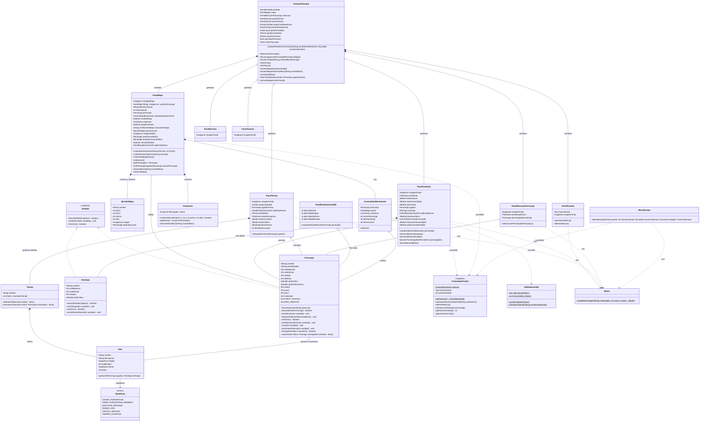

# Diagrama de Clases UML - Videojuego ELDAP

```mermaid
classDiagram
    %% Interfaces
    class Entidad {
        <<interface>>
        +atacar(Entidad objetivo) boolean
        +recibirDanio(int cantidad) void
        +estaVivo() boolean
    }

    %% Clases del Modelo
    class Personaje {
        #String nombre
        #String claseElegida
        #int vidaMaxima
        #int vidaActual
        #int ataque
        #int defensa
        #double probCritico
        #double probCriticoActual
        #int dinero
        #int posX
        #int posY
        #int velocidad
        #List~Item~ inventario
        #int MAX_OBJETOS
        +moverDireccion(String direccion)
        +atacar(Entidad enemigo) boolean
        +recibirDanio(int cantidad) void
        +mejorarAtributosAlDerrotarBoss() void
        +estaVivo() boolean
        +recibirDanioDirecto(int cantidad) void
        +curar(int cantidad) void
        +aumentarDefensa(int cantidad) void
        +recogerItem(Item nuevoItem) boolean
        +usarItem(int indice, Enemigo enemigoEnCombate) String
    }

    class Enemigo {
        #String nombre
        #int vidaMaxima
        #int vidaActual
        #int ataque
        #double probCritico
        +atacar(Entidad objetivo) boolean
        +recibirDanio(int cantidad) void
        +estaVivo() boolean
        +recibirDanioDirecto(int cantidad) void
    }

    class BossEnMapa {
        +String nombre
        +int posX
        +int posY
        +int ancho
        +int alto
        +ImageIcon imagen
        +Rectangle areaInteraccion
    }

    class Item {
        -String nombre
        -String descripcion
        -ImageIcon imagen
        -int modificador
        -TipoEfecto efecto
        -int precio
        +aplicarA(Personaje jugador, Enemigo enemigo)
    }

    class Tienda {
        -String nombre
        -List~Item~ inventarioTienda
        +obtenerInfoItems(int indice) String
        +procesarCompra(int indice, Personaje comprador) String
    }

    class TipoEfecto {
        <<enum>>
        CURAR_PORCENTAJE
        DANIO_PORCENTAJE_ENEMIGO
        DUPLICAR_DEFENSA
        ROBAR_VIDA
        CRITICO_SEGURO
        TRAMPA_GUANTON
    }

    %% Herencia y Relaciones del Modelo
    Entidad <|.. Personaje
    Entidad <|.. Enemigo
    Tienda "1" *-- "*" Item : ofrece
    Personaje "1" o-- "*" Item : posee en inventario
    Item --> TipoEfecto : categoriza

    %% Clases del Controlador
    class ControladorAudio {
        <<singleton>>
        -ControladorAudio instancia$
        -Clip musicaFondo
        -int volumenGlobal
        +getInstance()$ ControladorAudio
        +reproducirMusicaAmbiental(String rutaArchivo)
        +detenerMusica()
        +setVolumenGlobal(int porcentaje)
        +getVolumenGlobal() int
        -aplicarVolumenClip()
    }

    class UtilidadesAudio {
        -long ultimoSonidoPaso$
        -int COOLDOWN_PASOS$
        +resetCooldownPasos()$
        +reproducirSonido(String archivoActivacion)$
    }

    class ControladorMovimiento {
        -Personaje personaje
        -PanelMapa panel
        -Colisiones colisiones
        -int anchoPersonaje
        -int altoPersonaje
        -int ticAnimacion
        +detener()
    }

    class Colisiones {
        -ArrayList~Rectangle~ muros
        +verificarMovimiento(int x, int y, int ancho, int alto) boolean
        +getMuros() ArrayList~Rectangle~
        +eliminarMuroBoss(String nombreBoss)
    }

    class Boton {
        +crearBotonImagen(String rutaImagen, int ancho, int alto)$ JButton
    }


    %% Clases de la Vista
    class VentanaPrincipal {
        +PanelPortada portada
        +PanelMapa mapa
        +PanelEleccionPersonaje seleccion
        -PanelDerrota panelDerrota
        -PanelVictoria panelVictoria
        -PanelCombate panelCombateActual
        -PanelTienda panelTiendaActual
        -CardLayout gestorPantallas
        -JPanel panelContenedor
        -JPanel panelTransicion
        -float opacidadTransicion
        -Timer timerTransicion
        -cambiarPanelConTransicion(String nombrePanelDestino, Runnable accionIntermedia)
        +irEleccionPersonaje()
        +iniciarJuegoConPersonaje(Personaje elegido)
        +iniciarCombate(String nombreBossEnemigo)
        +irADerrota()
        +irAVictoria()
        +volverAMapaDesdeCombate()
        +volverAMapaYEliminarBoss(String nombreBoss)
        +cambiarAMenu()
        +abrirTienda(String tienda, Personaje jugadorActivo)
        +volverAMapaDesdeTienda()
    }

    class PanelPortada {
        -Clip musicaFondo
        -ImageIcon imagenFondo
        +reproducirMusica()
        +detenerMusica()
    }

    class PanelMapa {
        -ImageIcon imagenMapa
        -HashMap~String, ImageIcon~ spritesPersonaje
        -String direccionActual
        -int frameActual
        -Personaje personaje
        -ControladorMovimiento controladorMovimiento
        -boolean modoDebug
        -Colisiones colisiones
        -boolean juegoPausado
        -ArrayList~BossEnMapa~ bossesEnMapa
        -BossEnMapa bossCercano
        -ImageIcon imagenDelikia
        -Rectangle areaFisicaDelikia
        -Rectangle areaInteraccionDelikia
        -boolean cercaDeDelikia
        -PanelEstadisticasHUD hudEstadisticas
        +actualizarAnimacion(String direccion, int frame)
        +cambiarVolumenMusica(int porcentaje)
        +mostrarDialogoPausa()
        +interactuar()
        +getPersonaje() Personaje
        +setPersonajeJugador(Personaje nuevoPersonaje)
        +eliminarBoss(String nombreBoss)
        +reiniciarMapa()
    }

    class PanelTienda {
        -ImageIcon imagenFondo
        -Tienda maquinaDelikia
        -Personaje jugadorActivo
        -PanelEstadisticasHUD hudEstadisticas
        -JPanel panelMenu
        -JTextArea areaDescripcion
        -JButton botonComprar
        -JButton botonVolver
        -JButton[] botonesItems
        -int itemSeleccionado
        +setJugadorActivo(Personaje jugador)
    }

    class PanelCombate {
        -ImageIcon imagenFondo
        -JTextArea areaTexto
        -JButton botonAtacar
        -JButton botonUsarObjeto
        -JButton botonSalir
        -Personaje jugador
        -Enemigo enemigo
        -PanelEstadisticasHUD hudEstadisticas
        -JButton[] botonesItems
        -int itemSeleccionadoCombate
        -JButton botonConfirmarObjeto
        -JButton botonCancelarObjeto
        +cambiarVolumenMusica(int porcentaje)
        -animarVibracionEnemigo()
        -animarVibracionPantalla()
        -ejecutarTurnoJugador(Runnable accionJugador)
        -activarMenuObjetos()
    }

    class PanelEleccionPersonaje {
        -ImageIcon imagenFondo
        -JTextArea areaEstadisticas
        -Personaje personajeSeleccionado
        +seleccionarPersonaje(Personaje p)
    }

    class PanelEstadisticasHUD {
        -JLabel labelVida
        -JLabel labelAtaque
        -JLabel labelDefensa
        -JLabel labelMonedas
        +actualizarEstadisticas(Personaje personaje)
    }

    class MenuEscape {
        +MenuEscape(JFrame parent, int volumenActual, Runnable accionContinuar, Consumer~Integer~ accionVolumen)
    }

    class PanelDerrota {
        -ImageIcon imagenFondo
    }

    class PanelVictoria {
        -ImageIcon imagenFondo
    }

    %% Relaciones Vista - Vista
    VentanaPrincipal *-- PanelPortada : contiene
    VentanaPrincipal *-- PanelMapa : contiene
    VentanaPrincipal *-- PanelEleccionPersonaje : contiene
    VentanaPrincipal o-- PanelDerrota : gestiona
    VentanaPrincipal o-- PanelVictoria : gestiona
    VentanaPrincipal o-- PanelCombate : gestiona
    VentanaPrincipal o-- PanelTienda : gestiona
    
    %% Relaciones Vista - Modelo
    PanelMapa o-- Personaje : dibuja
    PanelMapa *-- BossEnMapa : muestra y detecta
    PanelCombate o-- Personaje : controla
    PanelCombate *-- Enemigo : crea pelea
    PanelTienda o-- Personaje : actualiza
    PanelTienda *-- Tienda : gestiona interfaz
    PanelEleccionPersonaje o-- Personaje : instancia base
    PanelEstadisticasHUD o-- Personaje : lee stats

    %% Relaciones Vista - Controlador
    PanelMapa *-- Colisiones : contiene
    PanelMapa *-- ControladorMovimiento : usa
    ControladorMovimiento o-- Personaje : mueve
    PanelCombate ..> UtilidadesAudio : usa SFX
    PanelCombate ..> ControladorAudio : usa BGM
    PanelMapa ..> ControladorAudio : usa BGM
    MenuEscape ..> ControladorAudio : muta BGM
    PanelPortada ..> Boton : usa
    PanelCombate ..> Boton : usa
    PanelTienda ..> Boton : usa
    PanelEleccionPersonaje ..> Boton : usa
    MenuEscape ..> Boton : usa
```