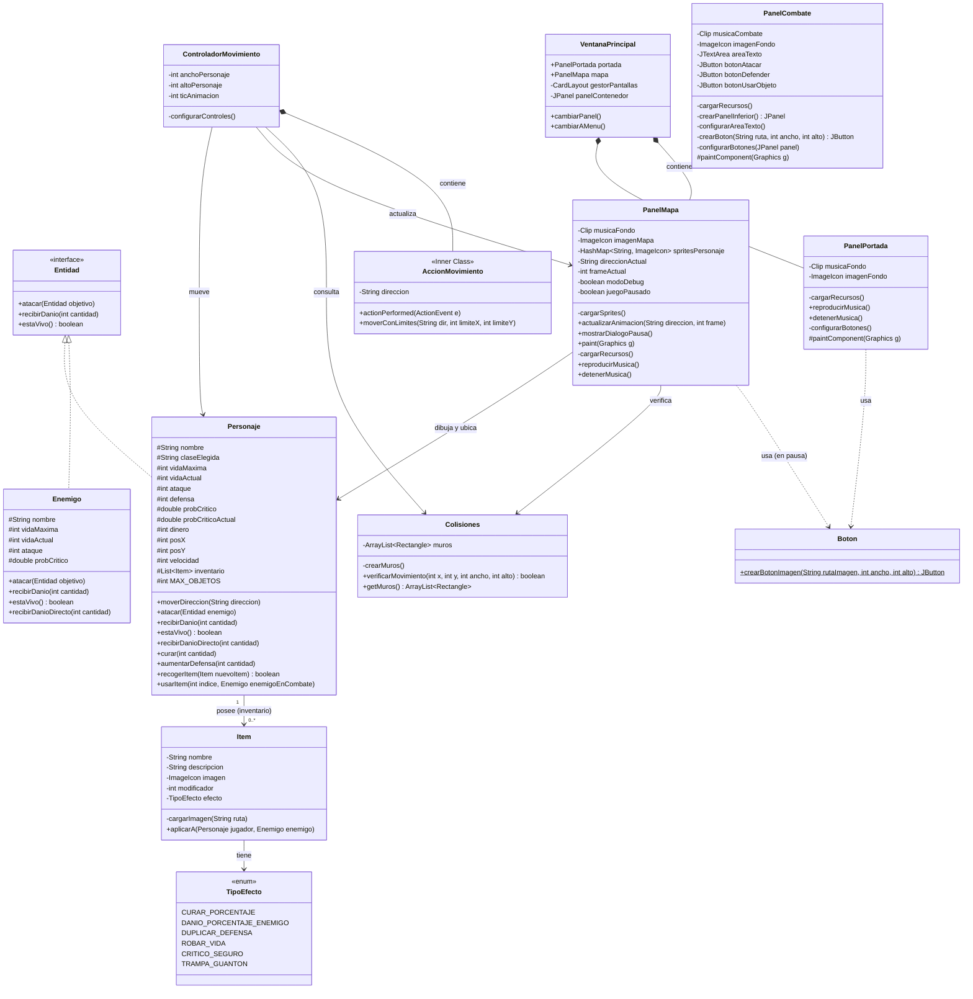

# Videojuego-Java

```mermaid
classDiagram
    %% Interfaces
    class Entidad {
        <<interface>>
        +atacar(Entidad objetivo)
        +recibirDanio(int cantidad)
        +estaVivo() boolean
    }

    %% Clases del Modelo
    class Personaje {
        #String nombre
        #String claseElegida
        #int vidaMaxima
        #int vidaActual
        #int ataque
        #int defensa
        #double probCritico
        #double probCriticoActual
        #int dinero
        #int posX
        #int posY
        #int velocidad
        #List~Item~ inventario
        #int MAX_OBJETOS
        +moverDireccion(String direccion)
        +atacar(Entidad enemigo)
        +recibirDanio(int cantidad)
        +estaVivo() boolean
        +recibirDanioDirecto(int cantidad)
        +curar(int cantidad)
        +aumentarDefensa(int cantidad)
        +recogerItem(Item nuevoItem) boolean
        +usarItem(int indice, Enemigo enemigoEnCombate)
    }

    class Enemigo {
        #String nombre
        #int vidaMaxima
        #int vidaActual
        #int ataque
        #double probCritico
        +atacar(Entidad objetivo)
        +recibirDanio(int cantidad)
        +estaVivo() boolean
        +recibirDanioDirecto(int cantidad)
    }

    class Item {
        -String nombre
        -String descripcion
        -ImageIcon imagen
        -int modificador
        -TipoEfecto efecto
        -cargarImagen(String ruta)
        +aplicarA(Personaje jugador, Enemigo enemigo)
    }

    class TipoEfecto {
        <<enum>>
        CURAR_PORCENTAJE
        DANIO_PORCENTAJE_ENEMIGO
        DUPLICAR_DEFENSA
        ROBAR_VIDA
        CRITICO_SEGURO
        TRAMPA_GUANTON
    }

    %% Clases del Controlador
    class Boton {
        +crearBotonImagen(String rutaImagen, int ancho, int alto)$ JButton
    }

    class Colisiones {
        -ArrayList~Rectangle~ muros
        -crearMuros()
        +verificarMovimiento(int x, int y, int ancho, int alto) boolean
        +getMuros() ArrayList~Rectangle~
    }

    class ControladorMovimiento {
        -int anchoPersonaje
        -int altoPersonaje
        -int ticAnimacion
        -configurarControles()
    }
    
    class AccionMovimiento {
        <<Inner Class>>
        -String direccion
        +actionPerformed(ActionEvent e)
        +moverConLimites(String dir, int limiteX, int limiteY)
    }

    %% Clases de la Vista
    class VentanaPrincipal {
        +PanelPortada portada
        +PanelMapa mapa
        -CardLayout gestorPantallas
        -JPanel panelContenedor
        +cambiarPanel()
        +cambiarAMenu()
    }

    class PanelPortada {
        -Clip musicaFondo
        -ImageIcon imagenFondo
        -cargarRecursos()
        +reproducirMusica()
        +detenerMusica()
        -configurarBotones()
        #paintComponent(Graphics g)
    }

    class PanelMapa {
        -Clip musicaFondo
        -ImageIcon imagenMapa
        -HashMap~String, ImageIcon~ spritesPersonaje
        -String direccionActual
        -int frameActual
        -boolean modoDebug
        -boolean juegoPausado
        -cargarSprites()
        +actualizarAnimacion(String direccion, int frame)
        +mostrarDialogoPausa()
        +paint(Graphics g)
        -cargarRecursos()
        +reproducirMusica()
        +detenerMusica()
    }

    class PanelCombate {
        -Clip musicaCombate
        -ImageIcon imagenFondo
        -JTextArea areaTexto
        -JButton botonAtacar
        -JButton botonDefender
        -JButton botonUsarObjeto
        -cargarRecursos()
        -crearPanelInferior() JPanel
        -configurarAreaTexto()
        -crearBoton(String ruta, int ancho, int alto) JButton
        -configurarBotones(JPanel panel)
        #paintComponent(Graphics g)
    }

    %% Herencia e Implementaciones
    Entidad <|.. Personaje
    Entidad <|.. Enemigo

    %% Relaciones y Asociaciones (Composición y Agregación)
    Item --> TipoEfecto : tiene
    Personaje "1" --> "0..*" Item : posee (inventario)
    
    %% Relaciones Vista - Modelo/Controlador
    PanelMapa --> Personaje : dibuja y ubica
    PanelMapa --> Colisiones : verifica
    
    %% Relaciones Controlador
    ControladorMovimiento --> Personaje : mueve
    ControladorMovimiento --> PanelMapa : actualiza
    ControladorMovimiento --> Colisiones : consulta
    ControladorMovimiento *-- AccionMovimiento : contiene
    
    %% Relaciones Vista Principal
    VentanaPrincipal *-- PanelPortada : contiene
    VentanaPrincipal *-- PanelMapa : contiene
    
    %% Uso de Botones
    PanelPortada ..> Boton : usa
    PanelMapa ..> Boton : usa (en pausa) 
```