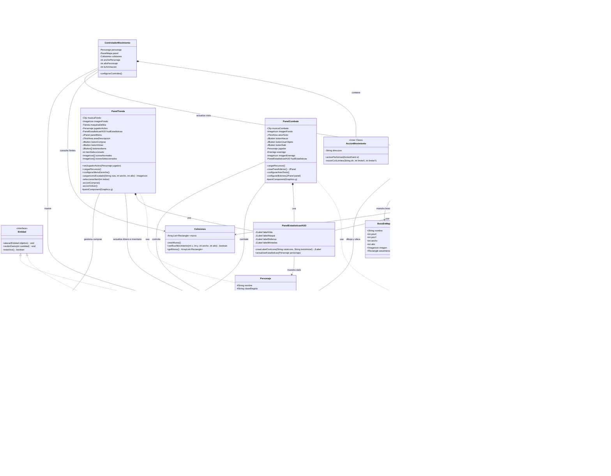

# Diagrama de Clases UML - Videojuego

```mermaid
classDiagram
    %% Interfaces
    class Entidad {
        <<interface>>
        +atacar(Entidad objetivo)  void
        +recibirDanio(int cantidad)  void
        +estaVivo()  boolean
    }

    %% Clases del Modelo
    class Personaje {
        #String nombre
        #String claseElegida
        #int vidaMaxima
        #int vidaActual
        #int ataque
        #int defensa
        #double probCritico
        #double probCriticoActual
        #int dinero
        #int posX
        #int posY
        #int velocidad
        #List~Item~ inventario
        #int MAX_OBJETOS
        +moverDireccion(String direccion)
        +atacar(Entidad enemigo)
        +recibirDanio(int cantidad)
        +mejorarAtributosAlDerrotarBoss()
        +estaVivo() boolean
        +recibirDanioDirecto(int cantidad)
        +curar(int cantidad)
        +aumentarDefensa(int cantidad)
        +recogerItem(Item nuevoItem) boolean
        +usarItem(int indice, Enemigo enemigoEnCombate)
    }

    class Enemigo {
        #String nombre
        #int vidaMaxima
        #int vidaActual
        #int ataque
        #double probCritico
        +atacar(Entidad objetivo)
        +recibirDanio(int cantidad)
        +estaVivo() boolean
        +recibirDanioDirecto(int cantidad)
    }

    class BossEnMapa {
        +String nombre
        +int posX
        +int posY
        +int ancho
        +int alto
        +ImageIcon imagen
        +Rectangle areaInteraccion
    }

    class Item {
        -String nombre
        -String descripcion
        -ImageIcon imagen
        -int modificador
        -TipoEfecto efecto
        -int precio
        -cargarImagen(String ruta)
        +aplicarA(Personaje jugador, Enemigo enemigo)
    }

    class Tienda {
        -String nombre
        -List~Item~ inventarioTienda
        -cargarMaquinaExpendedora()
        +obtenerInfoItems(int indice) String
        +procesarCompra(int indice, Personaje comprador) String
    }

    class TipoEfecto {
        <<enum>>
        CURAR_PORCENTAJE
        DANIO_PORCENTAJE_ENEMIGO
        DUPLICAR_DEFENSA
        ROBAR_VIDA
        CRITICO_SEGURO
        TRAMPA_GUANTON
    }

    %% Clases del Controlador
    class Boton {
        +crearBotonImagen(String rutaImagen, int ancho, int alto)$ JButton
    }

    class Colisiones {
        -ArrayList~Rectangle~ muros
        -crearMuros()
        +verificarMovimiento(int x, int y, int ancho, int alto) boolean
        +getMuros() ArrayList~Rectangle~
    }

    class ControladorMovimiento {
        -Personaje personaje
        -PanelMapa panel
        -Colisiones colisiones
        -int anchoPersonaje
        -int altoPersonaje
        -int ticAnimacion
        -configurarControles()
    }
    
    class AccionMovimiento {
        <<Inner Class>>
        -String direccion
        +actionPerformed(ActionEvent e)
        -moverConLimites(String dir, int limiteX, int limiteY)
    }

    %% Clase Principal
    class Main {
        +main(String[] args)$
    }

    %% Clases de la Vista
    class VentanaPrincipal {
        +PanelPortada portada
        +PanelMapa mapa
        +PanelEleccionPersonaje seleccion
        -CardLayout gestorPantallas
        -JPanel panelContenedor
        +iniciarCombate(String nombreBossEnemigo)
        +cambiarPanel()
        +irEleccionPersonaje()
        +iniciarJuegoConPersonaje(Personaje elegido)
        +abrirTienda(String tienda)
        +volverAMapaDesdeTienda()
        +volverAMapaDesdeCombate()
        +cambiarAMenu()
    }

    class PanelPortada {
        -Clip musicaFondo
        -ImageIcon imagenFondo
        -cargarRecursos()
        +reproducirMusica()
        +detenerMusica()
        -configurarBotones()
        #paintComponent(Graphics g)
    }

    class PanelEleccionPersonaje {
        -ImageIcon imagenFondo
        -JTextArea areaEstadisticas
        -Personaje personajeSeleccionado
        -Personaje muestraGuerrero
        -Personaje muestraMago
        -Personaje muestraAsesino
        +cargarFondo()
        +inicializaPersonaje()
        +configurarUI()
        +seleccionarPersonaje(Personaje p)
        #paintComponent(Graphics g)
    }

    class PanelMapa {
        -Clip musicaFondo
        -ImageIcon imagenMapa
        -HashMap~String, ImageIcon~ spritesPersonaje
        -String direccionActual
        -int frameActual
        -Personaje personaje
        -boolean modoDebug
        -Colisiones colisiones
        -boolean juegoPausado
        -ArrayList~BossEnMapa~ bossesEnMapa
        -BossEnMapa bossCercano
        -ImageIcon imagenDelikia
        -Rectangle areaFisicaDelikia
        -Rectangle areaInteraccionDelikia
        -boolean cercaDeDelikia
        -PanelEstadisticasHUD hudEstadisticas
        -inicializarDelikia()
        -inicializarBosses()
        -cargarSprites()
        +actualizarAnimacion(String direccion, int frame)
        +mostrarDialogoPausa()
        +paint(Graphics g)
        -cargarRecursos()
        +reproducirMusica()
        +detenerMusica()
        +getPersonaje() Personaje
        +setPersonajeJugador(Personaje nuevo)
    }

    class PanelTienda {
        -Clip musicaFondo
        -ImageIcon imagenFondo
        -Tienda maquinaDelikia
        -Personaje jugadorActivo
        -PanelEstadisticasHUD hudEstadisticas
        -JPanel panelMenu
        -JTextArea areaDescripcion
        -JButton botonComprar
        -JButton botonVolver
        -JButton[] botonesItems
        -int itemSeleccionado
        -ImageIcon[] iconosNormales
        -ImageIcon[] iconosSeleccionados
        +setJugadorActivo(Personaje jugador)
        +cargarRecursos()
        +configurarMenuDerecho()
        -cargarIconoEscalado(String ruta, int ancho, int alto) ImageIcon
        -seleccionarItem(int indice)
        -accionComprar()
        -accionVolver()
        #paintComponent(Graphics g)
    }

    class PanelCombate {
        -Clip musicaCombate
        -ImageIcon imagenFondo
        -JTextArea areaTexto
        -JButton botonAtacar
        -JButton botonUsarObjeto
        -JButton botonSalir
        -Personaje jugador
        -Enemigo enemigo
        -ImageIcon imagenEnemigo
        -PanelEstadisticasHUD hudEstadisticas
        -cargarRecursos()
        -crearPanelInferior() JPanel
        -configurarAreaTexto()
        -configurarBotones(JPanel panel)
        #paintComponent(Graphics g)
    }

    class PanelEstadisticasHUD {
        -JLabel labelVida
        -JLabel labelAtaque
        -JLabel labelDefensa
        -JLabel labelMonedas
        -crearLabelConIcono(String rutaIcono, String textoInicial) JLabel
        +actualizarEstadisticas(Personaje personaje)
    }

    class MenuEscape {
        +MenuEscape(JFrame parent, Runnable accionContinuar)
    }

    %% Herencia e Implementaciones
    Entidad <|.. Personaje
    Entidad <|.. Enemigo

    %% Relaciones y Asociaciones (Composición y Agregación)
    Item --> TipoEfecto : categoriza
    Tienda "1" *-- "0..*" Item : contiene
    Personaje "1" --> "0..*" Item : posee (inventario)
    
    %% Relaciones Vista - Modelo
    PanelMapa --> Personaje : dibuja y ubica
    PanelMapa --> BossEnMapa : muestra bosses
    PanelCombate --> Personaje : controla
    PanelCombate --> Enemigo : combate
    PanelTienda --> Tienda : gestiona compras
    PanelTienda --> Personaje : actualiza dinero e inventario
    PanelEleccionPersonaje --> Personaje : selecciona stats
    PanelEstadisticasHUD --> Personaje : muestra stats

    %% Relaciones Vista - Controlador
    PanelMapa --> Colisiones : verifica
    
    %% Relaciones Controlador - Modelo/Vista
    ControladorMovimiento --> Personaje : mueve
    ControladorMovimiento --> PanelMapa : actualiza vista
    ControladorMovimiento --> Colisiones : consulta límites
    ControladorMovimiento *-- AccionMovimiento : contiene
    
    %% Relaciones Vista Principal
    VentanaPrincipal *-- PanelPortada : contiene
    VentanaPrincipal *-- PanelMapa : contiene
    VentanaPrincipal *-- PanelEleccionPersonaje : contiene
    Main ..> VentanaPrincipal : inicia
    
    %% Uso de Componentes UI
    PanelCombate *-- PanelEstadisticasHUD : usa
    PanelMapa *-- PanelEstadisticasHUD : usa
    PanelTienda *-- PanelEstadisticasHUD : usa
    PanelMapa ..> MenuEscape : instancia
    
    %% Uso de Clase Helper
    MenuEscape ..> Boton : usa
    PanelPortada ..> Boton : usa
    PanelEleccionPersonaje ..> Boton : usa
    PanelCombate ..> Boton : usa
    PanelTienda ..> Boton : usa
```